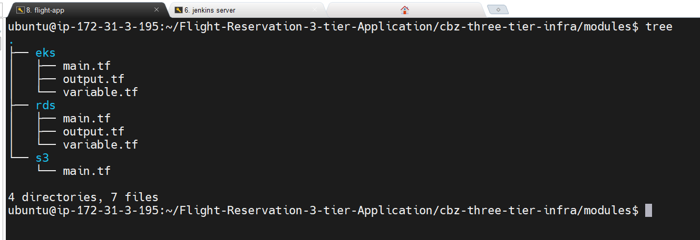
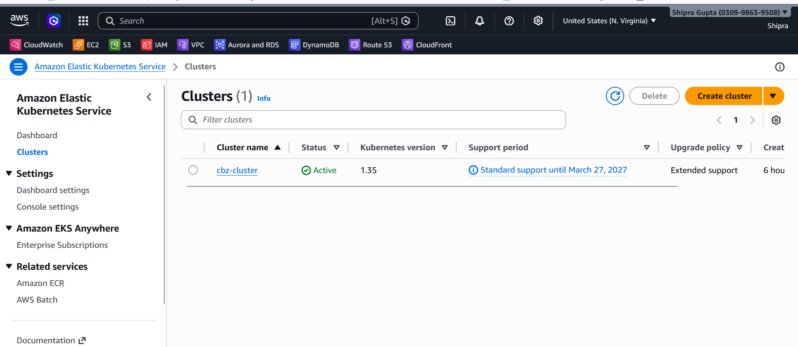
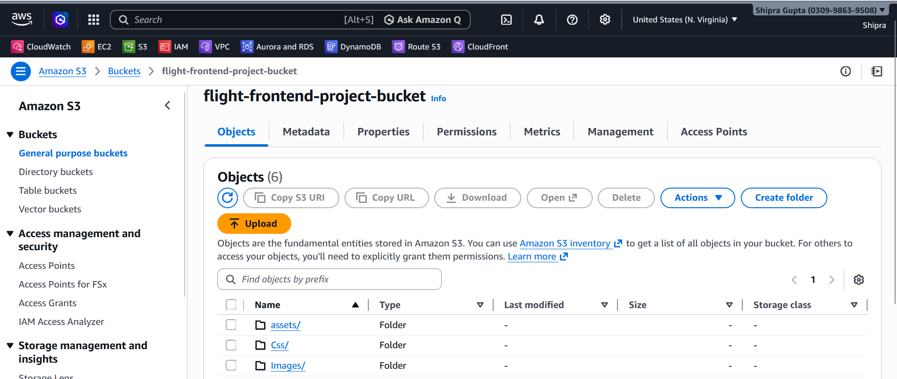
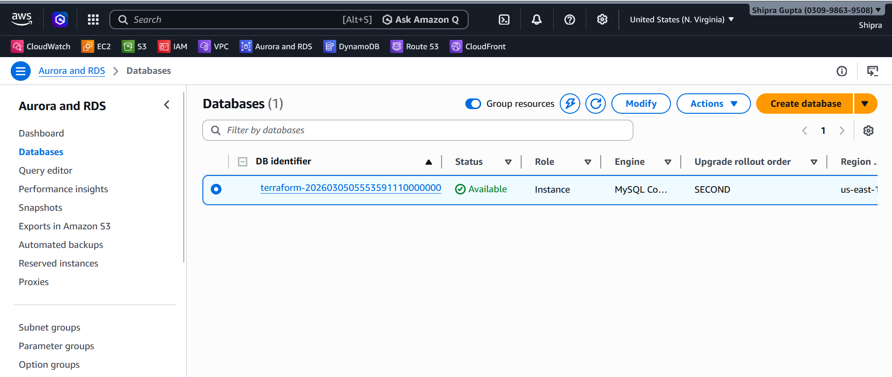
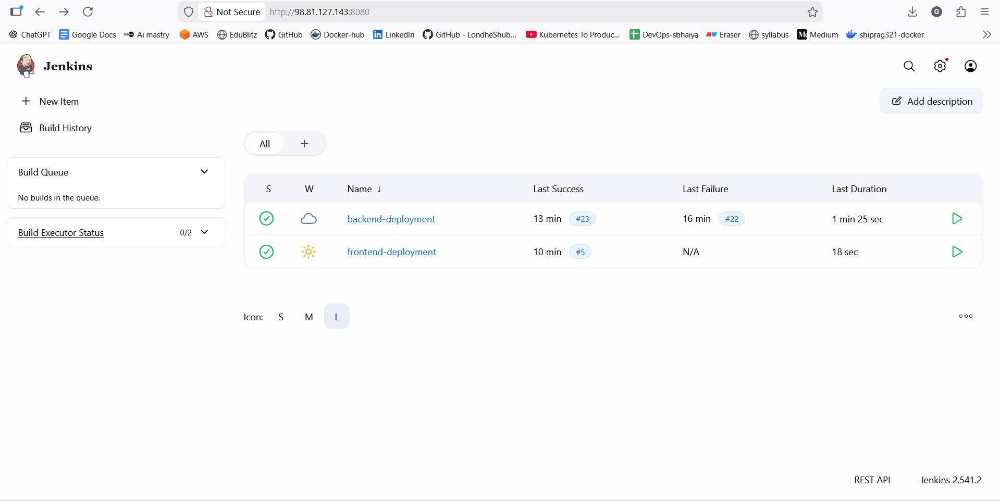
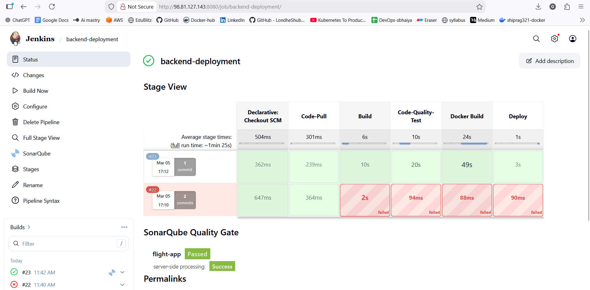
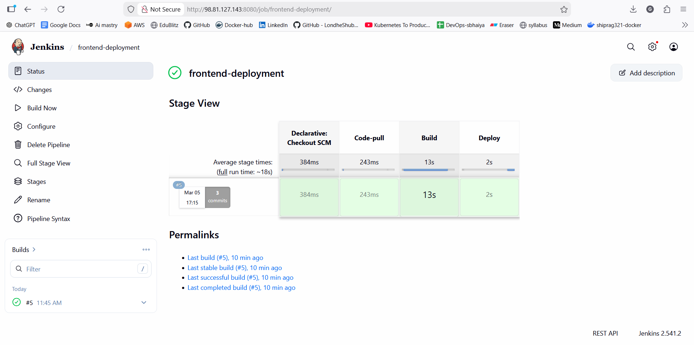
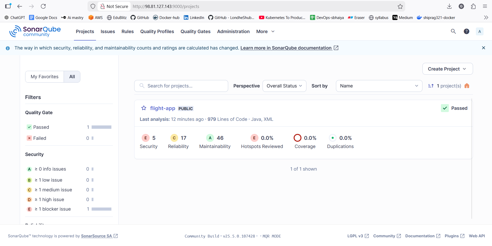

# **Flight Reservation System – 3 Tier DevOps Deployment**

---

# Overview

This project demonstrates the deployment of a **Flight Reservation System** using a **3-Tier Architecture** with modern **DevOps and Cloud technologies**.

The application is containerized using Docker and deployed on **AWS EKS (Kubernetes)**. The infrastructure is provisioned using **Terraform**, and a **CI/CD pipeline is implemented using Jenkins**. Code quality is analyzed using **SonarQube**, while AWS services such as **S3 and RDS** are used for storage and database management.

The main objective of this project is to simulate a **production-like DevOps workflow**, covering infrastructure automation, container orchestration, CI/CD automation, and cloud deployment.

---

### AWS Infrastructure

```
Developer
   |
GitHub Repository
   |
Jenkins CI/CD Pipeline
   |
Docker Build & Push
   |
AWS EKS Cluster
   |
Kubernetes Deployment
   |
Application Running on Pods
   |
AWS RDS (Database)
```

---

# Technologies Used

### Cloud

* AWS EKS
* AWS S3
* AWS RDS







### DevOps Tools

* Jenkins
* SonarQube
* Terraform
* Docker
* Kubernetes

### Development

* Java / Spring Boot (Backend)
* React / Web UI (Frontend)
* MySQL Database

---

# Project Workflow

The project follows a **DevOps CI/CD pipeline workflow**:

1. Developer pushes code to GitHub repository.
2. Jenkins pipeline is triggered automatically.
3. Code is built using the build tool.
4. SonarQube performs static code analysis.
5. Docker image is created and pushed to Docker registry.
6. Terraform provisions AWS infrastructure if required.
7. Application is deployed to **AWS EKS cluster** using Kubernetes manifests.
8. Application connects to **AWS RDS database**.
9. Frontend is served through the Kubernetes service.

---

# Infrastructure Provisioning (Terraform)

Terraform is used to automate the creation of cloud infrastructure.

Resources provisioned include:

* EKS Cluster
* RDS Database
* IAM Roles
* S3

Benefits of Terraform:

* Infrastructure as Code
* Reproducible environments
* Version-controlled infrastructure

---

# CI/CD Pipeline (Jenkins)

The Jenkins pipeline automates the application build and deployment process.

### Pipeline Stages

1. Code Checkout from GitHub
2. Build Application
3. SonarQube Code Analysis
4. Build Docker Image
5. Push Image to Docker Registry
6. Deploy to Kubernetes Cluster

This pipeline ensures **continuous integration and automated deployment**.





---

# Code Quality Analysis (SonarQube)

SonarQube is integrated into the Jenkins pipeline to analyze:

* Code quality
* Bugs
* Vulnerabilities
* Code smells

This helps maintain **high quality and secure code**.



---

# Containerization (Docker)

The application components are containerized using Docker.

Docker benefits in this project:

* Consistent environment
* Easy deployment
* Isolation between services

Each component runs in a separate container.

---

# Kubernetes Deployment (AWS EKS)

The application is deployed on **Amazon Elastic Kubernetes Service (EKS)**.

Kubernetes resources used:

* Deployment
* Service
* Pods
* ConfigMaps
* Secrets
* HPA
* Ingress

Benefits of Kubernetes:

* High availability
* Auto scaling
* Self-healing containers

---

# Database (AWS RDS)

The application uses **MySQL hosted on AWS RDS**.

Benefits:

* Managed database service
* Automated backups
* High availability
* Secure connectivity

---

# Storage (AWS S3)

AWS S3 is used for:

* Static storage
* Application artifacts
* Backup files

---

# How to Run the Project

### Step 1 – Clone the Repository

```
git clone https://github.com/Shipra-SG/Flight-Reservation-3-tier-Application.git
```

### Step 2 – Build Docker Images

```
docker build -t flight-reservation .
```

### Step 3 – Deploy Infrastructure

```
terraform init
terraform apply
```

### Step 4 – Deploy to Kubernetes

```
kubectl apply -f k8s/
```

---

# Learning Outcomes

Through this project, I gained hands-on experience with:

* Infrastructure as Code using Terraform
* CI/CD automation using Jenkins
* Code quality analysis using SonarQube
* Containerization using Docker
* Kubernetes orchestration on AWS EKS
* Deploying applications using a 3-tier architecture

---

# Future Improvements

* Implement monitoring using Prometheus and Grafana
* Add Helm charts for Kubernetes deployments
* Integrate automated testing in the CI/CD pipeline
* Add auto scaling policies

---

# Author

**Shipra**
DevOps Enthusiast | Cloud & Automation Learner
